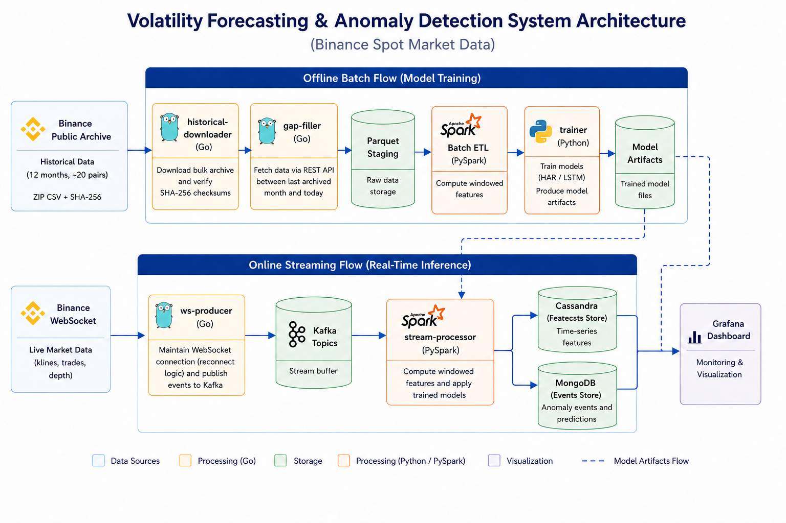

# Binance Volatility Forecasting & Anomaly Detection

A streaming Big Data and AI system that forecasts short-term price volatility on
Binance spot pairs and flags unusual market behaviour in real time. Built for
the BDA5011 course at Bahçeşehir University.

The core idea: volatility is what we *expect* the market to do over a window of
time, and an anomaly is something we *do not* expect. If we have a good
volatility forecast, an anomaly is simply a realised value that falls too far
from that forecast. This makes detection adaptive — the alert threshold tightens
when the market is calm and loosens when it is already volatile, instead of using
a fixed rule that fires constantly during busy hours and misses events during
quiet ones.

## What it does

- Trains two volatility forecasters offline (HAR-RV and an LSTM) on 12 months of
  1-minute klines for ~20 USDT pairs.
- Compares them on a held-out test set. HAR-RV gives the lower RMSE, so it is the
  model served live.
- Uses the HAR-RV forecast as the adaptive baseline for a conditional z-score
  anomaly detector.
- Runs the whole thing as a live pipeline: Go reads the Binance WebSocket, Kafka
  buffers, Spark computes features and applies the model, results land in
  Cassandra (time-series) and MongoDB (anomaly events), and Grafana visualises.

## Architecture



The offline path (historical download, training, evaluation) produces the model
artifacts that the online path loads. The two paths are kept separate, following
a Lambda architecture.

## Tech stack

| Layer        | Technology |
|--------------|------------|
| Ingestion    | Go (gorilla/websocket, segmentio/kafka-go) |
| Messaging    | Apache Kafka 3.9 |
| Stream compute | Apache Spark Structured Streaming (PySpark) |
| Time-series store | Apache Cassandra 5.0 |
| Event store  | MongoDB 7 |
| Dashboards   | Grafana 11 |
| ML / offline | Python, PyTorch (LSTM), scikit-learn, pandas |

## Repository layout

```
.
├── cmd/
│   ├── historical-downloader/   # Go: pull 12mo archive from Binance Vision + verify SHA-256
│   ├── gap-filler/              # Go: fill last-archived-month → today via REST
│   └── ws-producer/             # Go: live WebSocket → Kafka
├── internal/
│   ├── binance/                 # Go: kline event structs
│   └── kafka/                   # Go: Kafka producer wrapper
├── notebooks/
│   ├── 1_etl.ipynb              # raw klines → feature rows (realised variance, Parkinson, etc.)
│   ├── 2_split_scale.ipynb      # chronological split + per-symbol scaling (train stats only)
│   ├── 3_train.ipynb            # train HAR-RV and LSTM
│   └── 4_evaluate.ipynb         # test-set metrics + z-score anomaly detection
├── stream_processor.py          # PySpark live serving job
├── schema.cql                   # Cassandra keyspace + tables
├── docker-compose.yml           # Kafka, Spark, Cassandra, MongoDB, Grafana
├── go.mod / go.sum
└── README.md
```

## Prerequisites

- Docker and Docker Compose
- Go 1.21+ (to run the ingestion binaries on the host)
- A few GB of free disk for the historical archive (1–2 GB compressed for klines)
- Internet access to Binance public endpoints (no API key required — all data is
  free and public)

## Dataset

All data comes from free, public Binance sources. No account or API key is needed.

- **Historical klines**: [Binance Vision archive](https://data.binance.vision)
  — 12 months of 1-minute klines (roughly May 2025 – April 2026) for ~20 USDT
  pairs (BTCUSDT, ETHUSDT, SOLUSDT, BNBUSDT, XRPUSDT, ADAUSDT, DOGEUSDT, and
  more). Each file ships with a SHA-256 checksum, which the downloader verifies.
- **Live stream**: Binance public WebSocket
  (`wss://stream.binance.com:9443/ws`).

The downloader and gap-filler write CSVs to `data/klines/<SYMBOL>/`. The ETL
notebook reads from there and writes Parquet feature files.

## How to run

### 1. Start the infrastructure

```bash
docker compose up -d
```

This brings up Kafka, Spark (JupyterLab on `:8888`), Cassandra, MongoDB, and
Grafana. Wait for Cassandra to report healthy (it takes ~30–60s on first boot).

Service ports:
- JupyterLab (Spark): http://localhost:8888
- Kafka UI: http://localhost:8080
- Spark UI: http://localhost:4040 (only while a job is running)
- Grafana: http://localhost:3000 (admin / admin)

### 2. Create the database schema

```bash
docker exec -i cassandra cqlsh < schema.cql
```

### 3. Get the historical data

```bash
go run ./cmd/historical-downloader   # 12 months of klines, SHA-256 verified
go run ./cmd/gap-filler              # fill the gap from last archived month to today
```

The downloader is idempotent — it skips files already present, so re-runs are
cheap.

### 4. Train the models (offline)

Open JupyterLab at http://localhost:8888 and run the notebooks in order:

1. `1_etl.ipynb` — build feature rows from raw klines
2. `2_split_scale.ipynb` — chronological split and per-symbol scaling
3. `3_train.ipynb` — train HAR-RV and the LSTM, save artifacts
4. `4_evaluate.ipynb` — test-set metrics and the z-score detector

Training produces the HAR-RV coefficients used by the live serving job. The
coefficients are already hardcoded at the top of `stream_processor.py`; if you
retrain, update them there.

### 5. Run the live pipeline

In one terminal, start the producer:

```bash
go run ./cmd/ws-producer        # live WebSocket → Kafka
```

In another, start the stream processor (inside the Spark container, or anywhere
with PySpark + the Cassandra/Mongo drivers):

```bash
python stream_processor.py
```

It warms up a 24-hour price buffer per symbol from REST, then processes live
1-minute bars: computing realised variance, applying the HAR-RV forecast, and
flagging any window whose standardised residual exceeds the threshold
(`|z| > 4`). Forecasts go to Cassandra; anomalies go to MongoDB and print to the
console:

```
BTCUSDT   z=-5.20  <<< ANOMALY (saved)
```

### 6. Visualise

Open Grafana at http://localhost:3000, add the Cassandra data source (the
`hadesarchitect-cassandra-datasource` plugin is installed by compose), and build
panels on the `binance.forecasts` table. Plot `vol_realized` vs `vol_forecast`,
and `zscore` with threshold lines at ±4 so anomalies stand out.

## How the detector works

At each emission the processor computes a residual in log space between realised
volatility and the HAR-RV forecast, then standardises it against a per-symbol
rolling window of past residuals (288 steps, shifted by one so only the past is
used). A window is flagged when the absolute z-score exceeds 4.

The z-score is **signed**: a large positive z means realised volatility was far
*above* forecast (an unexpected spike), and a large negative z means it was far
*below* forecast (an unexpected calm). Both are flagged, since either is a
surprise relative to what the model expected.

## Notes on design choices

A few decisions differ between the offline and online paths, on purpose:

- **Emission cadence.** The offline notebooks emit one feature row every five
  minutes (the training target is 5-minute-spaced). The live `stream_processor.py`
  aggregates to 1-minute bars and runs the HAR forecast per minute, for a more
  responsive demo. The HAR coefficients transfer because the realised-variance
  windows (15m / 1h / 24h) are defined the same way in both.
- **Live kline interval.** The producer subscribes to the 1-second kline stream
  (`@kline_1s`) and Spark re-aggregates to 1-minute bars, rather than reading the
  1-minute stream directly. This gives finer control over bar boundaries.
- **Warm-up source.** The live processor seeds its price history from the Binance
  REST API at startup (last 24h per symbol). If a symbol's warm-up request fails,
  it starts empty and warms up from the live stream instead of crashing the whole
  job.
- **In-memory detector state.** The rolling residual history lives in process
  memory. Kafka gives durability and replay for the *raw events*, but if the
  Spark job restarts, the detector needs ~30 bars per symbol to warm its rolling
  statistics back up.

## Limitations

- The LSTM underperforms the linear HAR-RV baseline on RMSE (a few mid-cap pairs,
  notably NEARUSDT and XLMUSDT, drive its error up). HAR-RV is the served model.
- The anomaly detector is evaluated by alert rate and manual inspection, not
  against labelled ground truth — there is no public ground truth for "anomaly"
  on crypto streams.
- A second detection layer (Isolation Forest on a multivariate residual vector)
  and the bookTicker microstructure features are designed but not yet wired into
  the live model.

## Authors

Imadeddine Belkat — BDA5011, Bahçeşehir University.
